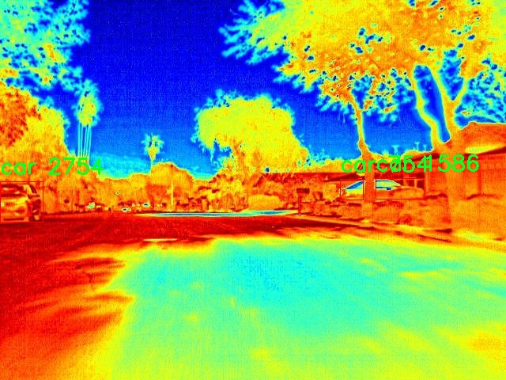
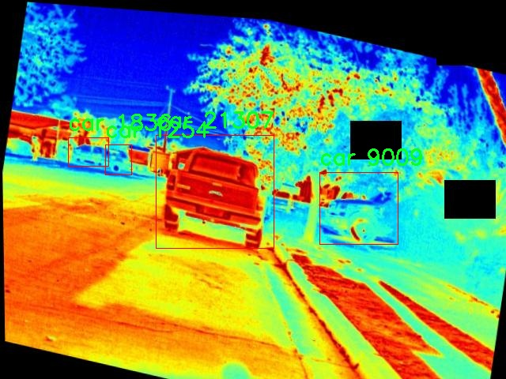
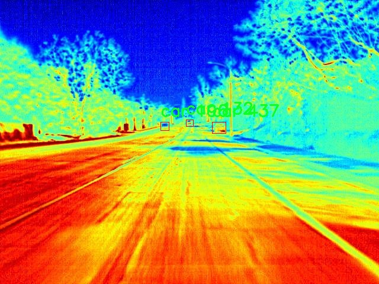

# 红外图像车辆与行人检测检测系统源码分享
 # [一条龙教学YOLOV8标注好的数据集一键训练_70+全套改进创新点发刊_Web前端展示]

### 1.研究背景与意义

项目参考[AAAI Association for the Advancement of Artificial Intelligence](https://gitee.com/qunshansj/projects)

项目来源[AACV Association for the Advancement of Computer Vision](https://gitee.com/qunmasj/projects)

研究背景与意义

随着城市化进程的加快，交通管理和安全问题日益凸显，尤其是在夜间或恶劣天气条件下，传统的视觉监控系统面临着诸多挑战。红外图像因其在低光照条件下的优越性能，逐渐成为智能交通系统中的重要组成部分。红外成像技术能够有效穿透雾霾、雨雪等恶劣天气，提供清晰的目标图像，从而为车辆与行人的检测提供了新的解决方案。近年来，深度学习技术的迅猛发展，尤其是目标检测领域的突破，使得基于卷积神经网络（CNN）的检测算法在精度和速度上均有了显著提升。其中，YOLO（You Only Look Once）系列算法因其实时性和高效性而受到广泛关注，尤其是最新的YOLOv8模型，其在处理复杂场景时展现出了更强的鲁棒性和准确性。

本研究旨在基于改进的YOLOv8模型，构建一个高效的红外图像车辆与行人检测系统。所使用的数据集FLIR ADAS priv 1000 color包含2100幅红外图像，涵盖了车辆和行人两个主要类别。这一数据集的选择不仅为模型的训练提供了丰富的样本，还为模型在实际应用中的推广奠定了基础。通过对该数据集的深入分析，我们可以识别出不同场景下车辆与行人的特征，从而为后续的模型改进提供数据支持。

在实际应用中，车辆与行人的实时检测不仅关系到交通安全，还涉及到智能交通系统的效率提升。通过改进YOLOv8模型，我们希望能够在保证检测精度的同时，提升检测速度，以满足实时监控的需求。此外，红外图像的特性使得该系统在夜间或低能见度条件下仍能保持良好的检测性能，这对于提升城市交通管理的智能化水平具有重要意义。

本研究的意义不仅在于技术上的创新，更在于其对社会实际问题的解决。随着智能交通系统的普及，如何有效地监测和管理交通流量、提高行人安全已成为亟待解决的课题。通过构建基于改进YOLOv8的红外图像检测系统，我们期望能够为交通管理部门提供一个可靠的工具，帮助其在复杂环境中快速、准确地识别交通参与者，从而降低交通事故发生率，提升城市交通的安全性和流畅性。

综上所述，本研究在理论与实践层面均具有重要意义。通过对YOLOv8模型的改进和红外图像数据集的有效利用，我们不仅可以推动目标检测技术的发展，还能够为智能交通系统的构建提供有力支持。这一研究不仅为学术界提供了新的研究视角，也为实际应用中的交通安全管理提供了切实可行的解决方案。

### 2.图片演示


##### 注意：由于此博客编辑较早，上面“2.图片演示”和“3.视频演示”展示的系统图片或者视频可能为老版本，新版本在老版本的基础上升级如下：（实际效果以升级的新版本为准）

  （1）适配了YOLOV8的“目标检测”模型和“实例分割”模型，通过加载相应的权重（.pt）文件即可自适应加载模型。

  （2）支持“图片识别”、“视频识别”、“摄像头实时识别”三种识别模式。

  （3）支持“图片识别”、“视频识别”、“摄像头实时识别”三种识别结果保存导出，解决手动导出（容易卡顿出现爆内存）存在的问题，识别完自动保存结果并导出到tempDir中。

  （4）支持Web前端系统中的标题、背景图等自定义修改，后面提供修改教程。

  另外本项目提供训练的数据集和训练教程,暂不提供权重文件（best.pt）,需要您按照教程进行训练后实现图片演示和Web前端界面演示的效果。

### 3.视频演示

[3.1 视频演示](https://www.bilibili.com/video/BV13Ft8eYEZY/)

### 4.数据集信息展示

##### 4.1 本项目数据集详细数据（类别数＆类别名）

nc: 2
names: ['car', 'person']


##### 4.2 本项目数据集信息介绍

数据集信息展示

在现代智能交通系统中，红外图像的应用日益广泛，尤其是在车辆与行人检测领域。为提升检测系统的准确性与鲁棒性，特别是针对复杂环境下的红外图像处理，选用合适的数据集至关重要。本研究所采用的数据集为“FLIR ADAS priv 1000 color”，该数据集专为自动驾驶和智能交通系统的研究而设计，涵盖了丰富的场景和多样的目标对象。

“FLIR ADAS priv 1000 color”数据集包含了多种复杂环境下的红外图像，主要用于训练和评估基于YOLOv8模型的车辆与行人检测系统。该数据集的类别数量为2，具体包括“car”（车辆）和“person”（行人）。这种简单而有效的类别设置，使得模型在训练过程中能够专注于识别这两类目标，从而提高检测的精度和速度。

在数据集的构建过程中，研究者们考虑了多种现实场景，包括城市街道、乡村道路以及夜间行驶等不同的环境因素。这些场景不仅涵盖了各种天气条件，如晴天、雨天和雾天，还考虑了不同的光照条件，确保模型在多变的环境中依然能够保持高效的检测能力。数据集中每张图像都经过精确标注，确保车辆和行人的位置及类别信息的准确性，这为后续的模型训练提供了坚实的基础。

此外，数据集的图像质量也经过严格把控，保证了红外图像的清晰度和细节表现。这对于YOLOv8模型的训练尤为重要，因为高质量的输入数据能够显著提升模型的学习效果和最终的检测性能。通过使用“FLIR ADAS priv 1000 color”数据集，研究者能够有效地利用深度学习技术，优化模型的参数设置，从而实现更高的检测精度和更快的推理速度。

在训练过程中，数据集的多样性和复杂性使得模型能够学习到丰富的特征，从而增强其在实际应用中的泛化能力。特别是在面对不同类型的车辆和行人时，模型能够通过学习到的特征，快速适应各种变化的环境和条件。这种适应性对于提升自动驾驶系统的安全性和可靠性具有重要意义。

总之，“FLIR ADAS priv 1000 color”数据集为改进YOLOv8的红外图像车辆与行人检测系统提供了丰富的训练素材。通过精确的标注和多样的场景设置，该数据集不仅提升了模型的检测性能，也为未来的研究提供了宝贵的数据支持。随着技术的不断进步，利用该数据集进行的研究将推动智能交通系统的发展，为实现更安全、高效的交通环境贡献力量。









### 5.全套项目环境部署视频教程（零基础手把手教学）

[5.1 环境部署教程链接（零基础手把手教学）](https://www.ixigua.com/7404473917358506534?logTag=c807d0cbc21c0ef59de5)


[5.2 安装Python虚拟环境创建和依赖库安装视频教程链接（零基础手把手教学）](https://www.ixigua.com/7404474678003106304?logTag=1f1041108cd1f708b01a)

### 6.手把手YOLOV8训练视频教程（零基础小白有手就能学会）

[6.1 手把手YOLOV8训练视频教程（零基础小白有手就能学会）](https://www.ixigua.com/7404477157818401292?logTag=d31a2dfd1983c9668658)

### 7.70+种全套YOLOV8创新点代码加载调参视频教程（一键加载写好的改进模型的配置文件）

[7.1 70+种全套YOLOV8创新点代码加载调参视频教程（一键加载写好的改进模型的配置文件）](https://www.ixigua.com/7404478314661806627?logTag=29066f8288e3f4eea3a4)

### 8.70+种全套YOLOV8创新点原理讲解（非科班也可以轻松写刊发刊，V10版本正在科研待更新）

由于篇幅限制，每个创新点的具体原理讲解就不一一展开，具体见下列网址中的创新点对应子项目的技术原理博客网址【Blog】：


[8.1 70+种全套YOLOV8创新点原理讲解链接](https://gitee.com/qunmasj/good)

### 9.系统功能展示（检测对象为举例，实际内容以本项目数据集为准）

图9.1.系统支持检测结果表格显示

  图9.2.系统支持置信度和IOU阈值手动调节

  图9.3.系统支持自定义加载权重文件best.pt(需要你通过步骤5中训练获得)

  图9.4.系统支持摄像头实时识别

  图9.5.系统支持图片识别

  图9.6.系统支持视频识别

  图9.7.系统支持识别结果文件自动保存

  图9.8.系统支持Excel导出检测结果数据


### 10.原始YOLOV8算法原理

原始YOLOv8算法原理

YOLO（You Only Look Once）系列算法自诞生以来，便以其高效的目标检测能力在计算机视觉领域占据了一席之地。YOLOv8作为该系列的最新版本，进一步优化了算法的精度和速度，标志着目标检测技术的又一次飞跃。YOLOv8的架构设计精巧，主要由输入层、Backbone骨干网络、Neck特征融合网络和Head检测模块四个部分组成，这种结构不仅增强了模型的特征提取能力，还提升了对不同尺度目标的检测性能。

在YOLOv8的输入部分，首先对图像进行预处理，包括调整图像比例、进行Mosaic增强以及瞄点计算等。这些预处理步骤旨在为后续的特征提取和目标检测奠定基础。Mosaic增强通过将多张图像拼接在一起，增加了训练数据的多样性，从而提升了模型的泛化能力。经过预处理的图像被送入Backbone网络进行特征提取。

YOLOv8的Backbone部分延续了YOLOv5的CSPDarknet思想，但对其进行了改进，采用了C2f模块替代了C3模块。C2f模块的设计灵感来源于YOLOv7的ELAN结构，通过引入多个shortcut连接，增强了梯度流动，缓解了深层网络中的梯度消失问题。这一模块由多个CBS（卷积+归一化+SiLU激活）模块和若干个Bottleneck构成，能够在保持轻量化的同时，提取出更加丰富的特征信息。C2f模块的输出特征图经过SPPF（快速空间金字塔池化）模块处理后，进一步提升了特征图的表达能力，使得模型能够更好地捕捉到目标的多尺度信息。

在Neck部分，YOLOv8采用了PAN-FPN（路径聚合网络-特征金字塔网络）结构，旨在实现多尺度特征的有效融合。通过将来自Backbone不同阶段的特征图进行整合，YOLOv8能够更好地捕捉到不同尺度目标的信息。这种特征融合不仅提高了目标检测的性能，也增强了模型的鲁棒性，使其在复杂场景下依然能够保持良好的检测效果。

YOLOv8的Head模块负责最终的目标检测和分类任务。与以往版本不同，YOLOv8采用了解耦头的结构，将回归分支和分类分支进行分离。这一设计使得模型在进行目标检测时，能够更快地收敛，提高了检测的效率。Head模块包含三个Detect检测器，分别用于处理不同尺度的特征图，最终生成检测结果。通过这种结构，YOLOv8能够在多个尺度上进行目标检测，确保了对各种尺寸目标的有效识别。

值得一提的是，YOLOv8在损失函数的设计上也进行了创新，采用了VFLLoss作为分类损失，并结合DFLLoss和CIoULoss进行回归损失的计算。这种损失函数的设计不仅提高了模型对小目标的检测能力，还有效解决了样本不平衡的问题，进一步提升了模型的整体性能。

在样本匹配策略方面，YOLOv8引入了TaskAligned的Assigner匹配方式，替代了传统的静态匹配策略。这一变化使得模型在训练过程中能够更灵活地适应不同的目标特征，提高了匹配的准确性和效率。

YOLOv8的设计理念不仅体现在其网络结构的创新上，还在于其对目标检测任务的深刻理解。通过引入多种数据增强技术，如Mosaic、Mixup、空间扰动和颜色扰动等，YOLOv8在训练过程中能够有效提高模型的鲁棒性和泛化能力。此外，YOLOv8的训练和部署框架也进行了优化，使得自定义模型的训练变得更加便捷。

总的来说，YOLOv8算法通过对网络结构的优化、特征融合的增强以及损失函数的创新，显著提升了目标检测的精度和速度。其在处理复杂场景和多尺度目标方面的出色表现，使其成为当前目标检测领域的前沿技术。随着YOLOv8的不断发展和应用，未来的目标检测任务将更加高效和准确，为各类计算机视觉应用提供强有力的支持。


### 11.项目核心源码讲解（再也不用担心看不懂代码逻辑）

#### 11.1 code\ultralytics\models\__init__.py

下面是对给定代码的逐行分析和注释，保留了最核心的部分：

```python
# Ultralytics YOLO 🚀, AGPL-3.0 license

# 从当前包中导入 RTDETR、SAM 和 YOLO 类
from .rtdetr import RTDETR  # 导入 RTDETR 类，用于实时目标检测
from .sam import SAM        # 导入 SAM 类，可能用于分割或其他任务
from .yolo import YOLO      # 导入 YOLO 类，主要用于目标检测

# 定义模块的公开接口，允许用户以简单的方式导入这些类
__all__ = "YOLO", "RTDETR", "SAM"  # 这将使得在使用 'from module import *' 时只导入这三个类
```

### 代码分析
1. **模块导入**：
   - 代码首先导入了三个类：`RTDETR`、`SAM` 和 `YOLO`。这些类可能是实现不同功能的核心组件，分别用于实时目标检测、分割或其他相关任务。

2. **`__all__` 变量**：
   - `__all__` 是一个特殊变量，用于定义当使用 `from module import *` 时，哪些名称会被导入。这里定义了三个类，表示它们是该模块的公共接口，用户可以直接使用这些类而无需知道模块内部的实现细节。

### 核心部分
- 该代码的核心在于类的导入和 `__all__` 的定义，确保用户可以方便地使用模块中的功能。

这个文件是Ultralytics YOLO项目中的一个初始化文件，通常用于定义模块的公共接口。在这个文件中，首先通过注释标明了该项目的名称“Ultralytics YOLO”以及其使用的许可证类型（AGPL-3.0）。接下来，文件从同一目录下导入了三个类或模块：RTDETR、SAM和YOLO。这些类或模块可能是该项目中实现不同功能的核心组件。

最后，`__all__`变量被定义为一个元组，包含了三个字符串“YOLO”、“RTDETR”和“SAM”。这个变量的作用是控制当使用`from module import *`语句时，哪些名称会被导入。通过定义`__all__`，用户在导入时只会得到这三个指定的名称，从而简化了导入过程并提高了代码的可读性。

总体来说，这个文件的主要功能是组织和简化模块的导入，使得其他文件在使用这些类或模块时更加方便。

#### 11.2 code\ultralytics\nn\modules\conv.py

以下是代码中最核心的部分，并附上详细的中文注释：

```python
import math
import torch
import torch.nn as nn

def autopad(k, p=None, d=1):  # kernel, padding, dilation
    """自动填充以确保输出形状与输入形状相同。"""
    if d > 1:
        # 如果扩张大于1，计算实际的卷积核大小
        k = d * (k - 1) + 1 if isinstance(k, int) else [d * (x - 1) + 1 for x in k]
    if p is None:
        # 如果没有提供填充，则自动计算填充
        p = k // 2 if isinstance(k, int) else [x // 2 for x in k]
    return p

class Conv(nn.Module):
    """标准卷积层，包含卷积、批归一化和激活函数。"""

    default_act = nn.SiLU()  # 默认激活函数为SiLU

    def __init__(self, c1, c2, k=1, s=1, p=None, g=1, d=1, act=True):
        """初始化卷积层，参数包括输入通道数、输出通道数、卷积核大小、步幅、填充、分组、扩张和激活函数。"""
        super().__init__()
        # 创建卷积层
        self.conv = nn.Conv2d(c1, c2, k, s, autopad(k, p, d), groups=g, dilation=d, bias=False)
        # 创建批归一化层
        self.bn = nn.BatchNorm2d(c2)
        # 根据输入参数选择激活函数
        self.act = self.default_act if act is True else act if isinstance(act, nn.Module) else nn.Identity()

    def forward(self, x):
        """前向传播，依次应用卷积、批归一化和激活函数。"""
        return self.act(self.bn(self.conv(x)))

class DWConv(Conv):
    """深度可分离卷积层。"""

    def __init__(self, c1, c2, k=1, s=1, d=1, act=True):
        """初始化深度可分离卷积层，参数包括输入通道数、输出通道数、卷积核大小、步幅、扩张和激活函数。"""
        super().__init__(c1, c2, k, s, g=math.gcd(c1, c2), d=d, act=act)

class ConvTranspose(nn.Module):
    """转置卷积层。"""

    default_act = nn.SiLU()  # 默认激活函数为SiLU

    def __init__(self, c1, c2, k=2, s=2, p=0, bn=True, act=True):
        """初始化转置卷积层，参数包括输入通道数、输出通道数、卷积核大小、步幅、填充、是否使用批归一化和激活函数。"""
        super().__init__()
        # 创建转置卷积层
        self.conv_transpose = nn.ConvTranspose2d(c1, c2, k, s, p, bias=not bn)
        # 创建批归一化层（如果需要）
        self.bn = nn.BatchNorm2d(c2) if bn else nn.Identity()
        # 根据输入参数选择激活函数
        self.act = self.default_act if act is True else act if isinstance(act, nn.Module) else nn.Identity()

    def forward(self, x):
        """前向传播，依次应用转置卷积、批归一化和激活函数。"""
        return self.act(self.bn(self.conv_transpose(x)))

class ChannelAttention(nn.Module):
    """通道注意力模块。"""

    def __init__(self, channels: int) -> None:
        """初始化通道注意力模块，参数为通道数。"""
        super().__init__()
        self.pool = nn.AdaptiveAvgPool2d(1)  # 自适应平均池化
        self.fc = nn.Conv2d(channels, channels, 1, 1, 0, bias=True)  # 1x1卷积
        self.act = nn.Sigmoid()  # 激活函数为Sigmoid

    def forward(self, x: torch.Tensor) -> torch.Tensor:
        """前向传播，计算通道注意力并与输入相乘。"""
        return x * self.act(self.fc(self.pool(x)))

class SpatialAttention(nn.Module):
    """空间注意力模块。"""

    def __init__(self, kernel_size=7):
        """初始化空间注意力模块，参数为卷积核大小。"""
        super().__init__()
        assert kernel_size in (3, 7), "卷积核大小必须为3或7"
        padding = 3 if kernel_size == 7 else 1
        self.cv1 = nn.Conv2d(2, 1, kernel_size, padding=padding, bias=False)  # 卷积层
        self.act = nn.Sigmoid()  # 激活函数为Sigmoid

    def forward(self, x):
        """前向传播，计算空间注意力并与输入相乘。"""
        return x * self.act(self.cv1(torch.cat([torch.mean(x, 1, keepdim=True), torch.max(x, 1, keepdim=True)[0]], 1)))

class CBAM(nn.Module):
    """卷积块注意力模块。"""

    def __init__(self, c1, kernel_size=7):
        """初始化CBAM模块，参数为输入通道数和卷积核大小。"""
        super().__init__()
        self.channel_attention = ChannelAttention(c1)  # 初始化通道注意力
        self.spatial_attention = SpatialAttention(kernel_size)  # 初始化空间注意力

    def forward(self, x):
        """前向传播，依次应用通道注意力和空间注意力。"""
        return self.spatial_attention(self.channel_attention(x))
```

### 代码说明
1. **自动填充函数 (`autopad`)**: 用于根据卷积核大小和扩张因子自动计算填充，以确保输出形状与输入形状相同。
  
2. **卷积层 (`Conv`)**: 这是一个标准的卷积层，包含卷积操作、批归一化和激活函数。可以根据需要选择不同的激活函数。

3. **深度可分离卷积 (`DWConv`)**: 继承自 `Conv`，实现了深度可分离卷积，适用于减少模型参数和计算量。

4. **转置卷积层 (`ConvTranspose`)**: 实现了转置卷积操作，常用于上采样。

5. **通道注意力模块 (`ChannelAttention`)**: 通过自适应平均池化和1x1卷积来计算通道注意力，增强特征的表达能力。

6. **空间注意力模块 (`SpatialAttention`)**: 通过对输入特征进行平均和最大池化后拼接，再通过卷积计算空间注意力。

7. **CBAM模块 (`CBAM`)**: 结合通道注意力和空间注意力的模块，用于提升特征的表示能力。

这些模块在深度学习模型中广泛应用，尤其是在计算机视觉任务中，能够有效提升模型的性能。

这个程序文件定义了一系列卷积模块，主要用于构建深度学习模型，特别是在目标检测和图像处理任务中。文件的核心是实现不同类型的卷积操作，包括标准卷积、深度卷积、转置卷积等，并提供了一些额外的功能，比如注意力机制和张量拼接。

首先，文件中定义了一个名为`autopad`的函数，用于自动计算卷积操作所需的填充，以确保输出的形状与输入相同。这个函数根据给定的卷积核大小、填充和扩张率来确定合适的填充量。

接下来，定义了多个卷积类。其中，`Conv`类实现了标准的卷积操作，包含卷积层、批归一化层和激活函数。`Conv2`类是一个简化的卷积模块，具有额外的1x1卷积以增强特征提取能力。`LightConv`类则实现了一种轻量级卷积结构，结合了标准卷积和深度卷积。

`DWConv`类实现了深度卷积，这是一种针对每个输入通道单独进行卷积的操作，通常用于减少模型的参数量和计算量。`DWConvTranspose2d`类实现了深度转置卷积，用于上采样操作。

`ConvTranspose`类实现了转置卷积，常用于生成模型或特征图的上采样。`Focus`类则用于将图像的空间信息集中到通道维度，以提高特征表示的效率。

`GhostConv`类实现了一种称为“幽灵卷积”的方法，通过使用较少的参数来生成更多的特征图，旨在提高计算效率。`RepConv`类是一个重复卷积模块，支持训练和推理阶段的不同结构，能够融合多个卷积层的权重。

此外，文件中还实现了几个注意力机制模块，包括`ChannelAttention`和`SpatialAttention`，它们分别关注通道和空间特征的重标定。`CBAM`类则结合了这两种注意力机制，以增强特征提取的能力。

最后，`Concat`类用于在指定维度上拼接多个张量，这在构建复杂的神经网络架构时非常有用。

总体而言，这个文件提供了一套灵活且高效的卷积模块，适用于各种深度学习任务，尤其是在计算机视觉领域。通过组合这些模块，用户可以构建出适合特定任务的神经网络结构。

#### 11.3 ui.py

```python
import sys
import subprocess

def run_script(script_path):
    """
    使用当前 Python 环境运行指定的脚本。

    Args:
        script_path (str): 要运行的脚本路径

    Returns:
        None
    """
    # 获取当前 Python 解释器的路径
    python_path = sys.executable

    # 构建运行命令
    command = f'"{python_path}" -m streamlit run "{script_path}"'

    # 执行命令
    result = subprocess.run(command, shell=True)
    if result.returncode != 0:
        print("脚本运行出错。")


# 实例化并运行应用
if __name__ == "__main__":
    # 指定您的脚本路径
    script_path = "web.py"  # 这里可以直接指定脚本路径

    # 运行脚本
    run_script(script_path)
```

### 代码核心部分及注释

1. **导入必要的模块**：
   - `sys`: 用于访问与 Python 解释器紧密相关的变量和函数。
   - `subprocess`: 用于生成新的进程、连接到它们的输入/输出/错误管道，并获取它们的返回码。

2. **定义 `run_script` 函数**：
   - 该函数接受一个参数 `script_path`，表示要运行的 Python 脚本的路径。
   - 使用 `sys.executable` 获取当前 Python 解释器的路径，以确保使用正确的 Python 环境来运行脚本。
   - 构建一个命令字符串，该命令使用 `streamlit` 模块运行指定的脚本。
   - 使用 `subprocess.run` 执行命令，并检查返回码以确定脚本是否成功运行。

3. **主程序块**：
   - 通过 `if __name__ == "__main__":` 确保该代码块仅在脚本作为主程序运行时执行。
   - 指定要运行的脚本路径（这里直接使用 `"web.py"`）。
   - 调用 `run_script` 函数来执行指定的脚本。

这个程序文件名为 `ui.py`，其主要功能是使用当前的 Python 环境来运行一个指定的脚本。代码首先导入了必要的模块，包括 `sys`、`os` 和 `subprocess`，以及一个自定义的 `abs_path` 函数，这个函数可能用于获取文件的绝对路径。

在 `run_script` 函数中，首先获取当前 Python 解释器的路径，这样可以确保在正确的环境中运行脚本。接着，构建一个命令字符串，这个命令使用 `streamlit` 来运行指定的脚本。`streamlit` 是一个用于构建数据应用的库，通常用于快速创建 Web 应用。

随后，使用 `subprocess.run` 方法执行构建好的命令。这个方法会在一个新的进程中运行命令，并等待其完成。如果命令执行后返回的状态码不为零，表示脚本运行出错，程序会打印出相应的错误信息。

在文件的最后部分，使用 `if __name__ == "__main__":` 语句来确保当该文件作为主程序运行时，才会执行后面的代码。在这里，指定了要运行的脚本路径为 `web.py`，并调用 `run_script` 函数来执行这个脚本。

总体来看，这个程序的设计目的是为了方便地运行一个 Streamlit 应用，确保在正确的 Python 环境中执行，并处理可能出现的错误。

#### 11.4 code\ultralytics\utils\downloads.py

以下是代码中最核心的部分，并附上详细的中文注释：

```python
import requests
from pathlib import Path
from zipfile import ZipFile, is_zipfile
from tqdm import tqdm  # 进度条库

def safe_download(url, file=None, dir=None, unzip=True, delete=False, retry=3, min_bytes=1e0, exist_ok=False):
    """
    从指定的 URL 下载文件，并可选择解压缩和删除下载的文件。

    参数:
        url (str): 要下载的文件的 URL。
        file (str, optional): 下载文件的文件名。如果未提供，将使用 URL 的文件名。
        dir (str, optional): 保存下载文件的目录。如果未提供，将保存在当前工作目录。
        unzip (bool, optional): 是否解压下载的文件。默认: True。
        delete (bool, optional): 是否在解压后删除下载的文件。默认: False。
        retry (int, optional): 下载失败时的重试次数。默认: 3。
        min_bytes (float, optional): 下载文件被视为成功的最小字节数。默认: 1E0。
        exist_ok (bool, optional): 解压时是否覆盖现有内容。默认: False。

    返回:
        (Path): 解压后的目录路径。
    """
    f = Path(dir or ".") / (file or url.split("/")[-1])  # 确定保存的文件路径
    if not f.is_file():  # 如果文件不存在
        for i in range(retry + 1):  # 尝试下载
            try:
                response = requests.get(url, stream=True)  # 发送 GET 请求
                response.raise_for_status()  # 检查请求是否成功
                with open(f, "wb") as f_opened:  # 以二进制写入模式打开文件
                    total_size = int(response.headers.get("Content-Length", 0))  # 获取文件大小
                    for data in tqdm(response.iter_content(chunk_size=8192), total=total_size // 8192, unit='KB'):
                        f_opened.write(data)  # 写入文件
                if f.stat().st_size > min_bytes:  # 检查文件大小是否符合要求
                    break  # 下载成功
            except Exception as e:
                if i >= retry:  # 如果达到重试次数，抛出异常
                    raise ConnectionError(f"下载失败: {url}") from e

    if unzip and f.exists() and f.suffix in (".zip", ".tar", ".gz"):  # 如果需要解压
        unzip_dir = dir or f.parent  # 解压目录
        if is_zipfile(f):  # 如果是 zip 文件
            with ZipFile(f) as zipObj:
                zipObj.extractall(unzip_dir)  # 解压到指定目录
        if delete:  # 如果需要删除下载的文件
            f.unlink()  # 删除文件
        return unzip_dir  # 返回解压后的目录

    return f  # 返回下载的文件路径
```

### 代码核心部分解释：
1. **safe_download 函数**：该函数用于从指定的 URL 下载文件，并提供解压缩和删除下载文件的选项。
2. **参数说明**：
   - `url`：要下载的文件的 URL。
   - `file`：下载后保存的文件名，默认使用 URL 的文件名。
   - `dir`：保存文件的目录，默认当前工作目录。
   - `unzip`：下载后是否解压缩文件，默认是解压。
   - `delete`：解压后是否删除下载的压缩文件，默认不删除。
   - `retry`：下载失败时的重试次数，默认是 3 次。
   - `min_bytes`：下载文件的最小字节数，确保下载成功。
   - `exist_ok`：解压时是否覆盖已存在的文件，默认不覆盖。

3. **下载过程**：
   - 使用 `requests` 库发送 GET 请求下载文件。
   - 通过 `tqdm` 库显示下载进度。
   - 检查下载的文件大小是否符合要求。

4. **解压缩过程**：
   - 检查文件后缀，如果是压缩文件，则使用 `ZipFile` 解压到指定目录。
   - 根据 `delete` 参数决定是否删除下载的压缩文件。

5. **返回值**：函数返回下载的文件路径或解压后的目录路径。

这个程序文件 `downloads.py` 是 Ultralytics YOLO 项目的一部分，主要用于处理文件的下载、解压和管理。代码中包含了多个函数，每个函数都有特定的功能，下面是对这些功能的详细说明。

首先，文件导入了一些必要的库，包括处理文件路径的 `Path`、网络请求的 `requests`、以及用于并发处理的 `ThreadPool`。这些库为后续的文件下载和处理提供了支持。

接下来，定义了一些与 GitHub 资源相关的常量，列出了多个 YOLO 模型的文件名，这些文件名将用于后续的下载和管理操作。

`is_url` 函数用于验证给定字符串是否为有效的 URL，并可选择性地检查该 URL 是否在线。它通过解析 URL 并尝试打开它来完成这个任务。

`delete_dsstore` 函数用于删除指定目录下的 `.DS_Store` 文件，这些文件是 macOS 系统生成的隐藏文件，可能在不同操作系统之间传输时造成问题。

`zip_directory` 函数用于将指定目录的内容压缩为 ZIP 文件，并排除特定的文件（如 `.DS_Store`）。它会在压缩过程中显示进度条，并返回生成的 ZIP 文件的路径。

`unzip_file` 函数用于解压 ZIP 文件到指定路径，并同样可以排除特定文件。它会检查目标路径是否已存在文件，并根据需要创建新目录。

`check_disk_space` 函数用于检查下载文件所需的磁盘空间是否充足。它会根据文件的大小和一个安全因子来判断是否有足够的空间，如果空间不足，可以选择抛出错误或返回警告。

`get_google_drive_file_info` 函数用于从 Google Drive 的共享链接中提取直接下载链接和文件名。这对于处理 Google Drive 上的文件下载非常有用。

`safe_download` 函数是文件下载的核心功能，支持从 URL 下载文件，并可以选择解压和删除下载的文件。它还支持重试机制，以应对下载失败的情况。

`get_github_assets` 函数用于从指定的 GitHub 仓库获取版本标签和资产列表，允许用户获取最新的发布版本或指定版本的文件。

`attempt_download_asset` 函数尝试从 GitHub 下载指定的文件，如果本地不存在该文件，则会进行下载。

最后，`download` 函数支持从一个或多个 URL 下载文件，支持并发下载和其他选项，如解压和删除 ZIP 文件。它使用 `ThreadPool` 来实现多线程下载，提升下载效率。

总体而言，这个文件提供了一整套用于文件下载、解压和管理的工具，适用于需要从网络获取模型文件或数据集的场景。

#### 11.5 70+种YOLOv8算法改进源码大全和调试加载训练教程（非必要）\ultralytics\utils\tuner.py

以下是代码中最核心的部分，并附上详细的中文注释：

```python
import subprocess  # 导入子进程模块，用于执行系统命令

from ultralytics.cfg import TASK2DATA, TASK2METRIC, get_save_dir  # 从配置中导入任务相关的映射
from ultralytics.utils import DEFAULT_CFG, DEFAULT_CFG_DICT, LOGGER, NUM_THREADS  # 导入默认配置、日志记录器和线程数

def run_ray_tune(model, space: dict = None, grace_period: int = 10, gpu_per_trial: int = None, max_samples: int = 10, **train_args):
    """
    使用 Ray Tune 进行超参数调优。

    参数:
        model (YOLO): 要进行调优的模型。
        space (dict, optional): 超参数搜索空间。默认为 None。
        grace_period (int, optional): ASHA 调度器的宽限期（以 epoch 为单位）。默认为 10。
        gpu_per_trial (int, optional): 每个试验分配的 GPU 数量。默认为 None。
        max_samples (int, optional): 要运行的最大试验次数。默认为 10。
        train_args (dict, optional): 传递给 `train()` 方法的额外参数。默认为 {}。

    返回:
        (dict): 包含超参数搜索结果的字典。
    """

    # 记录 Ray Tune 的学习链接
    LOGGER.info('💡 Learn about RayTune at https://docs.ultralytics.com/integrations/ray-tune')

    # 安装 Ray Tune 库
    subprocess.run('pip install ray[tune]'.split(), check=True)

    import ray  # 导入 Ray 库
    from ray import tune  # 从 Ray 导入调优模块
    from ray.air import RunConfig  # 导入运行配置
    from ray.air.integrations.wandb import WandbLoggerCallback  # 导入 Wandb 日志回调
    from ray.tune.schedulers import ASHAScheduler  # 导入 ASHA 调度器

    # 定义默认的超参数搜索空间
    default_space = {
        'lr0': tune.uniform(1e-5, 1e-1),  # 初始学习率
        'lrf': tune.uniform(0.01, 1.0),  # 最终学习率
        'momentum': tune.uniform(0.6, 0.98),  # 动量
        'weight_decay': tune.uniform(0.0, 0.001),  # 权重衰减
        'warmup_epochs': tune.uniform(0.0, 5.0),  # 预热 epoch 数
        'box': tune.uniform(0.02, 0.2),  # 边框损失增益
        'cls': tune.uniform(0.2, 4.0),  # 分类损失增益
        # 其他数据增强参数...
    }

    # 将模型放入 Ray 存储中
    model_in_store = ray.put(model)

    def _tune(config):
        """
        使用指定的超参数和额外参数训练 YOLO 模型。

        参数:
            config (dict): 用于训练的超参数字典。

        返回:
            None.
        """
        model_to_train = ray.get(model_in_store)  # 从 Ray 存储中获取模型
        model_to_train.reset_callbacks()  # 重置回调
        config.update(train_args)  # 更新配置
        results = model_to_train.train(**config)  # 训练模型
        return results.results_dict  # 返回结果字典

    # 获取搜索空间
    if not space:
        space = default_space  # 如果没有提供搜索空间，则使用默认空间

    # 获取数据集
    data = train_args.get('data', TASK2DATA[model.task])  # 获取数据集
    space['data'] = data  # 将数据集添加到搜索空间

    # 定义可训练函数及其资源分配
    trainable_with_resources = tune.with_resources(_tune, {'cpu': NUM_THREADS, 'gpu': gpu_per_trial or 0})

    # 定义 ASHA 调度器
    asha_scheduler = ASHAScheduler(time_attr='epoch', metric=TASK2METRIC[model.task], mode='max', max_t=train_args.get('epochs') or DEFAULT_CFG_DICT['epochs'] or 100, grace_period=grace_period, reduction_factor=3)

    # 创建 Ray Tune 超参数搜索调优器
    tune_dir = get_save_dir(DEFAULT_CFG, name='tune').resolve()  # 获取保存目录
    tune_dir.mkdir(parents=True, exist_ok=True)  # 创建目录
    tuner = tune.Tuner(trainable_with_resources, param_space=space, tune_config=tune.TuneConfig(scheduler=asha_scheduler, num_samples=max_samples), run_config=RunConfig(callbacks=[], storage_path=tune_dir))

    # 运行超参数搜索
    tuner.fit()

    # 返回超参数搜索的结果
    return tuner.get_results()
```

### 代码说明：
1. **导入必要的库**：首先导入了所需的库和模块，包括 Ray 和 Ultralytics 的相关配置。
2. **定义超参数调优函数**：`run_ray_tune` 函数用于执行超参数调优，接收模型和相关参数。
3. **安装 Ray Tune**：通过 `subprocess` 安装 Ray Tune 库。
4. **定义默认超参数空间**：设置了一系列超参数的搜索范围。
5. **模型存储**：将模型放入 Ray 的存储中，以便在调优过程中使用。
6. **训练函数**：定义了 `_tune` 函数，该函数使用给定的超参数训练模型并返回结果。
7. **获取数据集**：从训练参数中获取数据集，并将其添加到超参数空间中。
8. **资源分配**：定义了可训练函数及其资源分配（CPU 和 GPU）。
9. **调度器和调优器**：设置 ASHA 调度器和创建调优器，最后运行超参数搜索并返回结果。

这个程序文件是用于YOLOv8模型的超参数调优，利用了Ray Tune库来实现高效的超参数搜索。程序首先导入了一些必要的模块，包括subprocess、模型配置和日志记录工具。接着定义了一个名为`run_ray_tune`的函数，该函数接受多个参数，包括模型、超参数搜索空间、GPU分配、最大样本数等。

在函数内部，首先记录了一条信息，指向Ray Tune的文档。接着，程序尝试安装Ray Tune库，如果未安装则抛出一个模块未找到的异常。随后，程序导入Ray和相关的调度器、日志记录工具。

接下来，定义了一个默认的超参数搜索空间，其中包括学习率、动量、权重衰减、数据增强参数等。这些参数是模型训练过程中可能需要调整的超参数。

然后，程序将模型放入Ray的存储中，并定义了一个内部函数`_tune`，该函数负责使用给定的超参数训练YOLO模型，并返回训练结果。

接着，程序检查是否提供了超参数搜索空间，如果没有，则使用默认的搜索空间。同时，从训练参数中获取数据集信息，如果未提供数据集，则使用默认值。

之后，程序定义了一个可训练的函数，并为其分配资源。接着，定义了一个ASHAScheduler调度器，用于管理超参数搜索的进程，并设置了一些回调函数，特别是与Wandb集成的日志记录。

最后，程序创建了一个Ray Tune的超参数搜索调优器，并运行超参数搜索，最后返回搜索结果。这个程序的设计使得用户可以方便地进行YOLOv8模型的超参数调优，从而提高模型的性能。

#### 11.6 train.py

以下是代码中最核心的部分，并附上详细的中文注释：

```python
class DetectionTrainer(BaseTrainer):
    """
    DetectionTrainer类，继承自BaseTrainer类，用于基于检测模型的训练。
    """

    def build_dataset(self, img_path, mode="train", batch=None):
        """
        构建YOLO数据集。

        参数:
            img_path (str): 包含图像的文件夹路径。
            mode (str): 模式，`train`表示训练模式，`val`表示验证模式，用户可以为每种模式自定义不同的数据增强。
            batch (int, optional): 批次大小，仅用于`rect`模式。默认为None。
        """
        gs = max(int(de_parallel(self.model).stride.max() if self.model else 0), 32)  # 获取模型的最大步幅
        return build_yolo_dataset(self.args, img_path, batch, self.data, mode=mode, rect=mode == "val", stride=gs)

    def get_dataloader(self, dataset_path, batch_size=16, rank=0, mode="train"):
        """构造并返回数据加载器。"""
        assert mode in ["train", "val"]  # 确保模式是训练或验证
        with torch_distributed_zero_first(rank):  # 仅在DDP情况下初始化数据集
            dataset = self.build_dataset(dataset_path, mode, batch_size)  # 构建数据集
        shuffle = mode == "train"  # 训练模式下打乱数据
        if getattr(dataset, "rect", False) and shuffle:
            LOGGER.warning("WARNING ⚠️ 'rect=True'与DataLoader的shuffle不兼容，设置shuffle=False")
            shuffle = False
        workers = self.args.workers if mode == "train" else self.args.workers * 2  # 设置工作线程数
        return build_dataloader(dataset, batch_size, workers, shuffle, rank)  # 返回数据加载器

    def preprocess_batch(self, batch):
        """对一批图像进行预处理，包括缩放和转换为浮点数。"""
        batch["img"] = batch["img"].to(self.device, non_blocking=True).float() / 255  # 将图像转换为浮点数并归一化
        if self.args.multi_scale:  # 如果启用多尺度
            imgs = batch["img"]
            sz = (
                random.randrange(self.args.imgsz * 0.5, self.args.imgsz * 1.5 + self.stride)
                // self.stride
                * self.stride
            )  # 随机选择新的尺寸
            sf = sz / max(imgs.shape[2:])  # 计算缩放因子
            if sf != 1:
                ns = [
                    math.ceil(x * sf / self.stride) * self.stride for x in imgs.shape[2:]
                ]  # 计算新的形状
                imgs = nn.functional.interpolate(imgs, size=ns, mode="bilinear", align_corners=False)  # 进行插值缩放
            batch["img"] = imgs  # 更新图像
        return batch

    def set_model_attributes(self):
        """设置模型的属性，包括类别数量和名称。"""
        self.model.nc = self.data["nc"]  # 将类别数量附加到模型
        self.model.names = self.data["names"]  # 将类别名称附加到模型
        self.model.args = self.args  # 将超参数附加到模型

    def get_model(self, cfg=None, weights=None, verbose=True):
        """返回YOLO检测模型。"""
        model = DetectionModel(cfg, nc=self.data["nc"], verbose=verbose)  # 创建检测模型
        if weights:
            model.load(weights)  # 加载权重
        return model

    def get_validator(self):
        """返回YOLO模型验证器。"""
        self.loss_names = "box_loss", "cls_loss", "dfl_loss"  # 定义损失名称
        return yolo.detect.DetectionValidator(
            self.test_loader, save_dir=self.save_dir, args=copy(self.args), _callbacks=self.callbacks
        )

    def label_loss_items(self, loss_items=None, prefix="train"):
        """
        返回带有标签的训练损失项字典。

        对于分类不需要，但对于分割和检测是必要的。
        """
        keys = [f"{prefix}/{x}" for x in self.loss_names]  # 创建损失项的键
        if loss_items is not None:
            loss_items = [round(float(x), 5) for x in loss_items]  # 将张量转换为保留5位小数的浮点数
            return dict(zip(keys, loss_items))  # 返回键值对字典
        else:
            return keys

    def plot_training_samples(self, batch, ni):
        """绘制带有注释的训练样本。"""
        plot_images(
            images=batch["img"],
            batch_idx=batch["batch_idx"],
            cls=batch["cls"].squeeze(-1),
            bboxes=batch["bboxes"],
            paths=batch["im_file"],
            fname=self.save_dir / f"train_batch{ni}.jpg",
            on_plot=self.on_plot,
        )

    def plot_metrics(self):
        """从CSV文件中绘制指标。"""
        plot_results(file=self.csv, on_plot=self.on_plot)  # 保存结果图像

    def plot_training_labels(self):
        """创建YOLO模型的标记训练图。"""
        boxes = np.concatenate([lb["bboxes"] for lb in self.train_loader.dataset.labels], 0)  # 合并所有边界框
        cls = np.concatenate([lb["cls"] for lb in self.train_loader.dataset.labels], 0)  # 合并所有类别
        plot_labels(boxes, cls.squeeze(), names=self.data["names"], save_dir=self.save_dir, on_plot=self.on_plot)  # 绘制标签
```

以上代码是YOLO检测模型训练的核心部分，包含了数据集构建、数据加载、图像预处理、模型设置、损失计算、训练样本绘制等功能。每个方法都有详细的中文注释，便于理解其功能和作用。

这个程序文件 `train.py` 是一个用于训练 YOLO（You Only Look Once）目标检测模型的实现，继承自 `BaseTrainer` 类。文件中包含了多个方法，用于构建数据集、获取数据加载器、预处理图像批次、设置模型属性、获取模型、验证模型、记录损失、显示训练进度、绘制训练样本和绘制训练指标等。

首先，`DetectionTrainer` 类通过 `build_dataset` 方法构建 YOLO 数据集。该方法接收图像路径、模式（训练或验证）和批次大小作为参数，并根据模型的步幅计算合适的尺寸。接着，`get_dataloader` 方法用于构建数据加载器，确保在分布式训练中只初始化一次数据集。它会根据模式决定是否打乱数据，并设置工作线程的数量。

在数据预处理方面，`preprocess_batch` 方法将图像批次转换为浮点数并进行缩放，支持多尺度训练。该方法根据设定的图像大小随机选择新的尺寸，并使用双线性插值调整图像大小。

`set_model_attributes` 方法用于设置模型的属性，包括类别数量和类别名称等，以确保模型能够正确处理训练数据。`get_model` 方法则返回一个 YOLO 检测模型，并可以加载预训练权重。

在验证模型时，`get_validator` 方法返回一个用于验证的 `DetectionValidator` 实例，负责计算损失并保存结果。`label_loss_items` 方法用于返回带有标签的训练损失字典，便于监控训练过程中的损失变化。

此外，`progress_string` 方法生成一个格式化的字符串，显示训练进度，包括当前的轮次、GPU 内存使用情况、损失值、实例数量和图像大小等信息。`plot_training_samples` 方法则用于绘制训练样本及其标注，帮助可视化训练过程。

最后，`plot_metrics` 和 `plot_training_labels` 方法分别用于绘制训练过程中的指标和创建带标签的训练图，以便于分析模型的性能和训练效果。

总体来说，这个文件提供了一个完整的框架，用于训练 YOLO 模型，涵盖了数据处理、模型构建、训练监控和结果可视化等多个方面。

### 12.系统整体结构（节选）

### 程序整体功能和构架概括

该程序是一个完整的 YOLOv8 目标检测框架，旨在提供高效的模型训练、推理和超参数调优功能。它的构架分为多个模块，每个模块负责特定的功能，包括模型定义、卷积操作、数据处理、文件下载、超参数调优、训练过程控制和用户界面等。整体上，程序通过模块化设计，确保了代码的可维护性和可扩展性。

- **模型定义**：通过 `ultralytics.models` 模块定义 YOLOv8 及其变种模型。
- **卷积操作**：在 `ultralytics.nn.modules.conv` 中实现各种卷积层，支持模型的特征提取。
- **数据处理**：通过 `ultralytics.data.base` 和其他相关模块处理数据集，构建数据加载器。
- **文件管理**：`ultralytics.utils.downloads` 负责从网络下载模型和数据集。
- **超参数调优**：`ultralytics.utils.tuner` 提供了超参数搜索功能，利用 Ray Tune 库进行高效调优。
- **训练控制**：`train.py` 负责模型的训练过程，包括数据预处理、损失计算和训练监控。
- **用户界面**：`ui.py` 提供了一个简单的界面，用于运行和管理训练任务。

### 文件功能整理表

| 文件路径                                                                                      | 功能描述                                                                                      |
|-----------------------------------------------------------------------------------------------|-----------------------------------------------------------------------------------------------|
| `code\ultralytics\models\__init__.py`                                                        | 定义模块的公共接口，导入 YOLO、RTDETR 和 SAM 模型。                                           |
| `code\ultralytics\nn\modules\conv.py`                                                        | 实现各种卷积层和相关操作，包括标准卷积、深度卷积、转置卷积和注意力机制。                     |
| `ui.py`                                                                                       | 提供一个简单的用户界面，用于运行指定的 Streamlit 脚本。                                       |
| `code\ultralytics\utils\downloads.py`                                                        | 处理文件下载、解压和管理，支持从 GitHub 和 Google Drive 下载模型和数据集。                    |
| `70+种YOLOv8算法改进源码大全和调试加载训练教程（非必要）\ultralytics\utils\tuner.py`         | 实现超参数调优功能，利用 Ray Tune 进行高效的超参数搜索。                                     |
| `70+种YOLOv8算法改进源码大全和调试加载训练教程（非必要）\ultralytics\models\yolo\__init__.py` | 定义 YOLO 模型的初始化，导入相关模块和功能。                                                  |
| `70+种YOLOv8算法改进源码大全和调试加载训练教程（非必要）\ultralytics\models\fastsam\prompt.py` | 实现 FastSAM 模型的提示功能，可能用于图像分割或目标检测任务。                                 |
| `70+种YOLOv8算法改进源码大全和调试加载训练教程（非必要）\ultralytics\models\sam\modules\decoders.py` | 实现 SAM 模型的解码器，处理模型输出的特征图。                                               |
| `70+种YOLOv8算法改进源码大全和调试加载训练教程（非必要）\ultralytics\trackers\byte_tracker.py` | 实现 ByteTracker，用于目标跟踪，可能与 YOLO 模型结合使用。                                   |
| `70+种YOLOv8算法改进源码大全和调试加载训练教程（非必要）\ultralytics\data\base.py`          | 定义数据集的基本类和方法，支持数据加载和预处理。                                             |
| `70+种YOLOv8算法改进源码大全和调试加载训练教程（非必要）\ultralytics\models\yolo\model.py`  | 定义 YOLO 模型的结构和前向传播逻辑，负责模型的训练和推理。                                   |
| `70+种YOLOv8算法改进源码大全和调试加载训练教程（非必要）\ultralytics\models\sam\predict.py` | 实现 SAM 模型的预测功能，处理输入数据并生成输出结果。                                       |

这个表格总结了各个文件的主要功能，帮助理解整个程序的结构和各个模块之间的关系。

注意：由于此博客编辑较早，上面“11.项目核心源码讲解（再也不用担心看不懂代码逻辑）”中部分代码可能会优化升级，仅供参考学习，完整“训练源码”、“Web前端界面”和“70+种创新点源码”以“13.完整训练+Web前端界面+70+种创新点源码、数据集获取”的内容为准。

### 13.完整训练+Web前端界面+70+种创新点源码、数据集获取


# [下载链接：https://mbd.pub/o/bread/ZpuWlJxp](https://mbd.pub/o/bread/ZpuWlJxp)